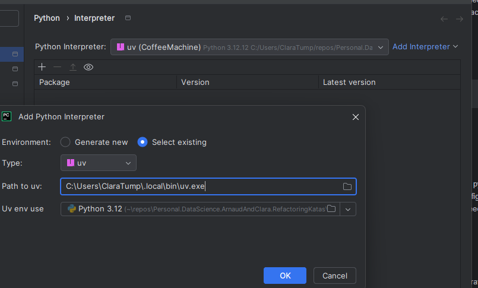

# Coffee Machine Refactoring Kata

## Assignment (20 mins)
Implement the Typestate pattern only. Create a separate class per state, 
each exposing only the valid next method returning the next type (e.g. EmptyMachine.fill_water() -> WaterFilledMachine). 
Run your typechecker. Write a valid sequence — it passes. Write EmptyMachine().brew(), confirm the typechecker catches it. 
Done. You've felt the pattern.

### Detailed explanation
The goal is to refactor coffee_machine.py so that invalid transitions become typechecker errors instead of runtime exceptions. 
Each state should be its own class, each method should return the next type. 
When you're done, the InvalidStateError and all the guard clauses should be gone.

### How to check your work:

Run `mypy --strict --allow-redefinition coffee_machine.py` (or `pyright` in strict mode)
The happy path script should pass with no type errors
Add a line like `EmptyMachine().brew()` and confirm the typechecker flags it
The tests will need to change too. The TestInvalidTransitions tests no longer make sense as runtime tests. 
Consider replacing them with a small script of "should-fail" lines and verifying mypy/pyright rejects them

Hint: Start by creating `EmptyMachine` with a single method `fill_water() -> WaterFilledMachine`, then work forward one state at a time. 
The pour() method on the final state should return `tuple[str, EmptyMachine]` to close the cycle.


## Type checkers
- mypy: standard, slow
- pyright: slightly faster than mypy
- ty: rust-based from Astral (uv, ruff), very fast. Still in active development. Less aggressive (you should not have to add types to working code to pass type checks)
- pyrefly: rust-based from meta, very fast. Still in active development. More aggressive

https://blog.edward-li.com/tech/comparing-pyrefly-vs-ty/

## Domain
A coffee machine moves through: Empty → WaterFilled → BeansLoaded → CupPlaced → Brewed → Poured (back to Empty). 
Each state only allows the next valid action.

## Setup
```bash
uv sync
```
Settings > Add Interpreter > local interpreter > select existing > uv
. Uv env use `CoffeeMachine/.venv/Scripts/python.exe`


## Typechecker Setup
Use either mypy (mypy --strict --allow-redefinition) or pyright (pyright in strict mode, 
set "typeCheckingMode": "strict" in pyrightconfig.json). 
Pyright handles variable redefinition out of the box — no extra flag needed. Pick one and stick with it throughout.

